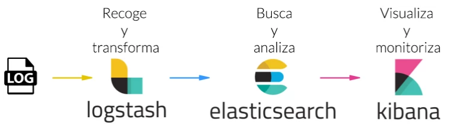
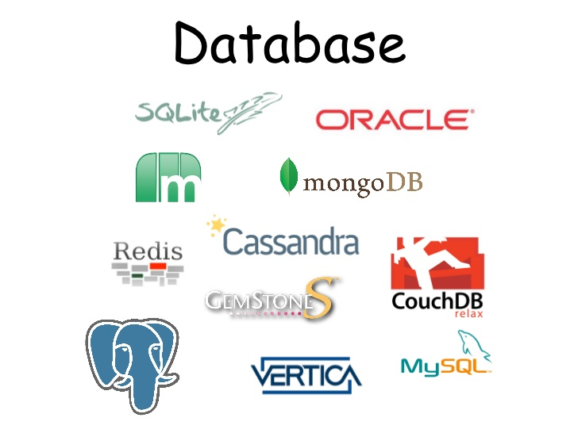

# Proyecto de bases de datos multidimensional.

 

El objetivo de este proyecto es centralizar la información de diversas fuentes de información como los son bases de datos de naturaleza SQL y noSQL ademas de información raspada desde la web de algun sitio como: **Tweeter, facebook e Instagran**.

**Integrantes
>Fernando Sanmartin	

>Bryan Farinango

>Bryan Perez

>Dennis Nunez

# Software usado

-ElasticSearch
-Logstash
-Kibana

 

-Python

 
-CouchDB (noSQL)
-MongoDB (noSQL)
-MySql (SQL)

 

## Carpetas y archivos

en la carpeta cosecha se encontrara los scripts para el raspado de información de Tweeter e Instagran ademas de la transformación de datos por parte de Logstach y una pagina que muestra los resultados del análisis realizado. 

## Codigo base de Scraping

   import couchdb #Libreria de CouchDB (requiere ser instalada primero)
 from tweepy import Stream #tweepy es la librería que trae tweets desde la API de Twitter (requiere ser instalada primero)
from tweepy import OAuthHandler
from tweepy.streaming import StreamListener
import json #Librería para manejar archivos JSON

#En esta sección se debe ingresar los tokens generados como usuarios develop de Tweeter.
ckey = ""
csecret = ""
atoken = ""
asecret = ""

class listener(StreamListener):
    
    def on_data(self, data):
        dictTweet = json.loads(data)
        try:
            dictTweet["_id"] = str(dictTweet['id'])
           
            doc = db.save(dictTweet) #Aqui se guarda el tweet en la base de couchDB
            print ("Guardado " + "=> " + dictTweet["_id"])
        except:
            print ("Documento ya existe")
            pass
        return True
    
    def on_error(self, status):
        print (status)
        
auth = OAuthHandler(ckey, csecret)
auth.set_access_token(atoken, asecret)
twitterStream = Stream(auth, listener())

#Setear la URL del servidor de couchDB
server = couchdb.Server('http://localhost:5984/')
try:
    #Si no existe la Base de datos la crea
    db = server.create('transito')
except:
    #Caso contrario solo conectarse a la base existente
    db = server['transito']
    
#Aquí se define el bounding box con los limites geográficos donde recolectar los tweets
twitterStream.filter(track=["AMTQuito","ATMGuayaquil","ECU911Loja","emov_ep","ECU911Ambato"])

## Recolectando Información en CouchDB

