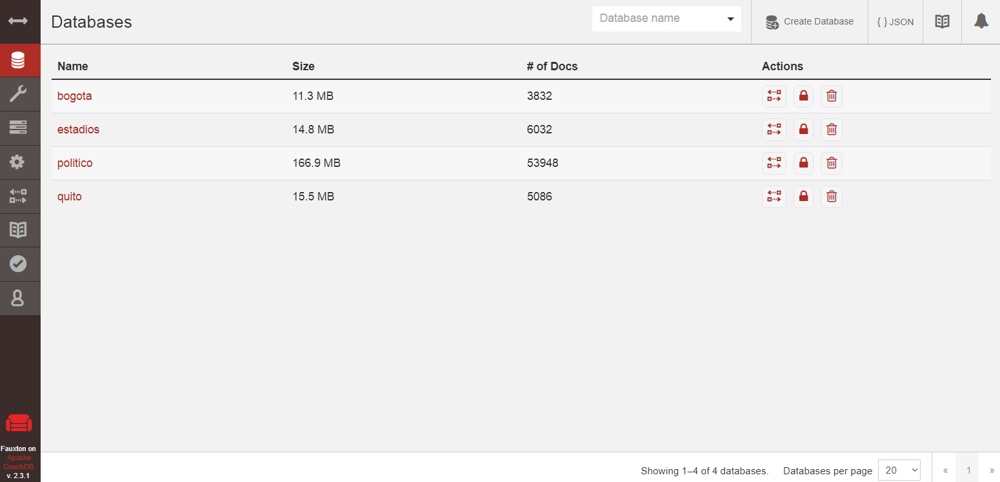
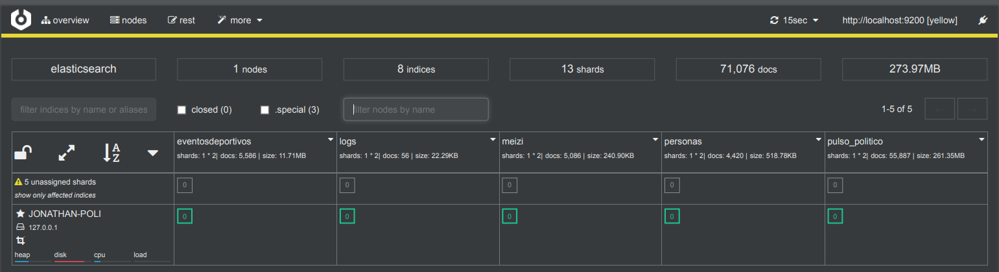

# Proyecto de bases de datos multidimensional.

 

El objetivo de este proyecto es centralizar la información de diversas fuentes de información como los son bases de datos de naturaleza SQL y noSQL ademas de información raspada desde la web de algun sitio como: **Tweeter, facebook e Instagran**.

**Integrantes
>Fernando Sanmartin	

>Bryan Farinango

>Bryan Perez

>Dennis Nunez

 

# Software usado

-ElasticSearch
-Logstash
-Kibana

 

-Python

 

   
-CouchDB (noSQL)
-MongoDB (noSQL)
-MySql (SQL)

 

## Carpetas y archivos

en la carpeta cosecha se encontrara los scripts para el raspado de información de Tweeter e Instagran ademas de la transformación de datos por parte de Logstach y una pagina que muestra los resultados del análisis realizado. 

## Codigo base de Scraping
import couchdb #Libreria de CouchDB (requiere ser instalada primero)
     from tweepy import Stream #tweepy es la librería que trae tweets desde la API de Twitter (requiere ser instalada primero)
    from tweepy import OAuthHandler
    from tweepy.streaming import StreamListener
    import json #Librería para manejar archivos JSON
    
    #En esta sección se debe ingresar los tokens generados como usuarios develop de Tweeter.
    ckey = ""
    csecret = ""
    atoken = ""
    asecret = ""
    
    class listener(StreamListener):
        
        def on_data(self, data):
            dictTweet = json.loads(data)
            try:
                dictTweet["_id"] = str(dictTweet['id'])
               
                doc = db.save(dictTweet) #Aqui se guarda el tweet en la base de couchDB
                print ("Guardado " + "=> " + dictTweet["_id"])
            except:
                print ("Documento ya existe")
                pass
            return True
        
        def on_error(self, status):
            print (status)
            
    auth = OAuthHandler(ckey, csecret)
    auth.set_access_token(atoken, asecret)
    twitterStream = Stream(auth, listener())
    
    #Setear la URL del servidor de couchDB
    server = couchdb.Server('http://localhost:5984/')
    try:
        #Si no existe la Base de datos la crea
        db = server.create('transito')
    except:
        #Caso contrario solo conectarse a la base existente
        db = server['transito']
        
    #Aquí se define el bounding box con los limites geográficos donde recolectar los tweets
    twitterStream.filter(track=["AMTQuito","ATMGuayaquil","ECU911Loja","emov_ep","ECU911Ambato"])

## Recolectando Información en CouchDB

 

## Transformacion 

        input{
    couchdb_changes{
    db=>"nombreBDDCOUCH"
    } }
    output {
     elasticsearch {
     index => "nombreIndiceElasticsearch"
     
     }
    }

## Mapeo de datos

  

    {
        "mappings": {
          "doc": {
            "properties": {
              "created_at": {
                "type": "date",
                "format": "EE MMM d HH:mm:ss Z yyyy||dd/MM/yyyy||dd-MM-yyyy||date_optional_time"
              },
    
              "favorited":{  
                    "type": "boolean"
                },
              
              "geo":{
                  "type":"geo_point"
              },
              
              "id":{
                  "type":"long"
              },
              
              "user":{
                  "properties":{
                    
                    "id":{
                    "type":"long"    
                    },
                    
                    "created_at":{
                      "type": "date",
               "format": "EE MMM d HH:mm:ss Z yyyy||dd/MM/yyyy||dd-MM-yyyy||date_optional_time"
                  }
              }
              }
            }
          }
        }
    }

## DATALAKE

 

## Importar datos CSV a una base de datos MySQL

En este caso se hara uso de un script en Python en el cual seran necesarias tres librerias las cuales se deberan instalar previamente antes de ejecutar el script.

Librerias:

Estas dos primeras nos serviran tanto para leer el archivo CSV como establecer conexion con MySQL respectivamente.
   - pandas
   - sqlalchemy

La siguiente libreria nos servira para ejcutar las sentencia SQL e insertar los datos recolectados en la base de datos.
   - MySQL-Python

A continuación, se procede a detallar el codigo respectivo del script:

   - Primero se importa las librerias mencionadas anteriormente.

"import pandas as pd
from sqlalchemy import create_engine"

   - Haciendo uso de la libreria 'pandas', procedemos a leer el archivo CSV con la función 'read_csv()' enviando como parametros: el directorio del archivo CSV que se va a importar, la localizacion de la cabecera del archivo, la codificación de carateres que posee el archivo y con la funcion 'print()' se procede a mostrar los datos obtenidos.
   
"df = pd.read_csv('C:/proyecto/bdd-servicios-2012empalme.csv', header = 0, encoding='latin-1')
print(df)"

   - Mediante el uso de la libreria 'sqlalchemy' se procede a establecer conexion con MySQL con la funcion 'create_engine()', a la cual se le enviara el parametro de nuestra cadena de conexión seguida del nombre de la base de datos en la cual se almacenaran los datos extraidos y finalmente utilizando la funcion 'to_sql()' se procede a insertar los datos extraidos en la base de datos preciamente seleccionada.
